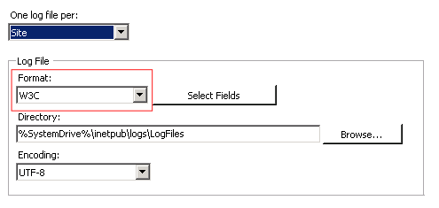
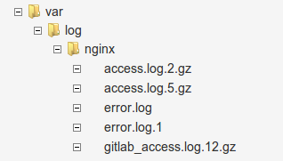
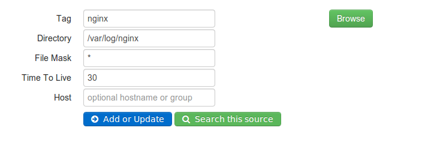
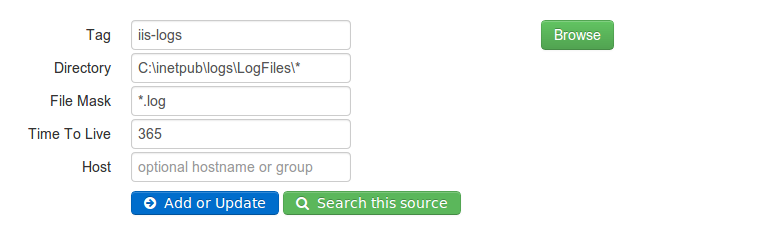
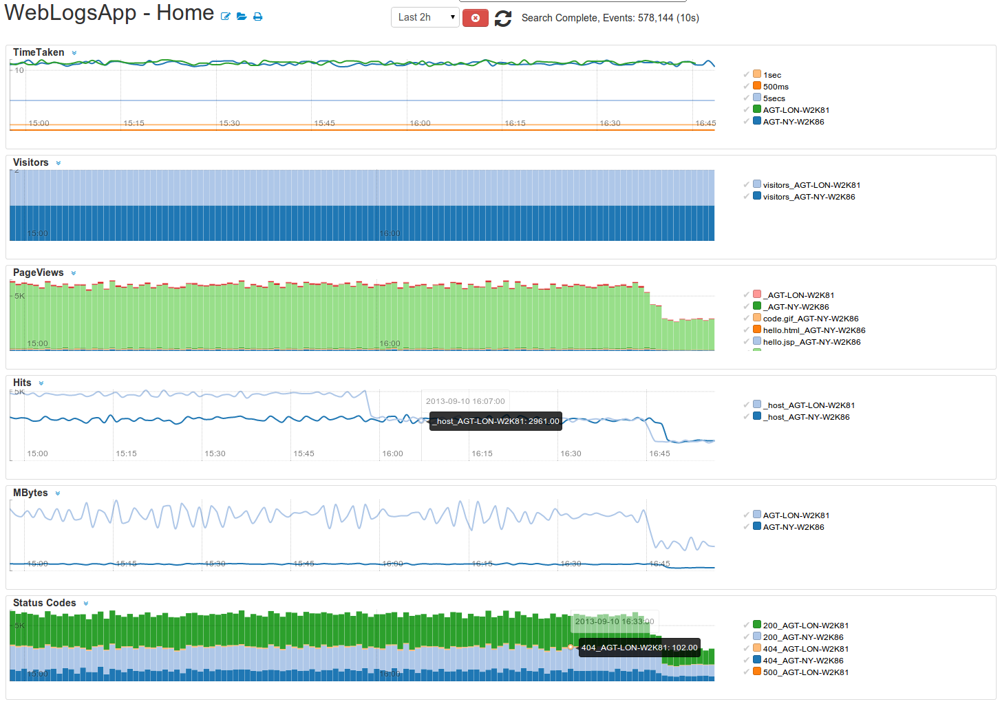
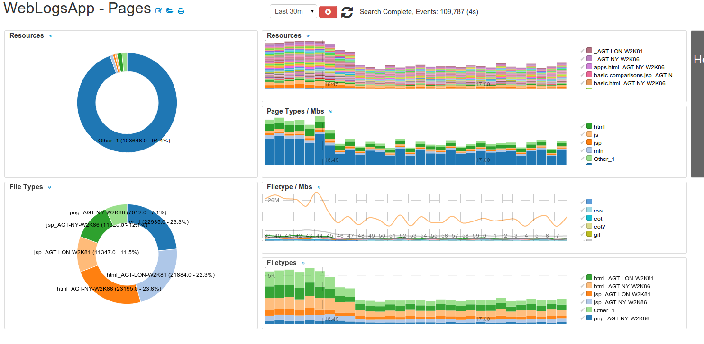
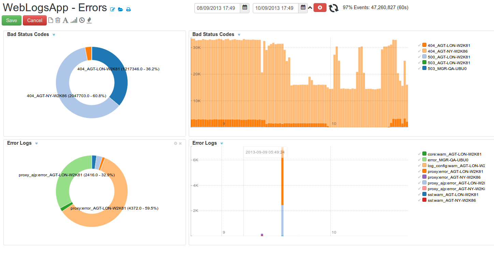

WeblogsApp-1.0
===========
 
The WebLogApp monitors your web traffic and server error logs. It provides searches for access logs produced by 

 * Apache 
 * Microsoft IIS Web Server 
 * Nginx
 * Web Servers which support the eXtended Log Format ( XLF) . 

# Downloads 

Read [How to deploy](http://logscape.github.io/deploy.html) for basic App installation instructions  
Read [How to import data](http://logscape.github.io/datasources.html) to learn about data sources

 * [WeblogsApp-1.0.zip](https://github.com/logscape/unixapp/raw/master/dist/WeblogsApp-1.0.zip)

## Setting up Apache 
The WebLogApp supports the most commont web server log formats.

 Common Log Format  ( www-clf ) 

        LogFormat "%h %l %u %t \"%r\" %>s %b" common

 Extended /NCSA Log Format ( www-xlf) 

        LogFormat "%h %l %u %t \"%r\" %>s %b \"%{Referer}i\" \"%{User-agent}i\"" ncsa

 Custom log that includes the time taken to serve a page (%D) 

        LogFormat "%h %l %u %t \"%r\" %>s %b \"%{Referer}i\" \"%{User-agent}i\" %D"  custom

 json example

        LogFormat "timestamp:\"%t\", request: \"%r\", ...

You will need to use the 'custom' format to include the time taken to serve pages in your access log. If this isn't included some of your charts may appear blank . 

### Setting up IIS 

IIS uses W3C log format by default. The default logs provide useful information including the time taken to serve a web page

  

Make sure that you have W3C selected. 

### Setting up Nginx 

Nginx supports the XLF log format by default for most common installations.  To add the the time taken metric use the following log directive for your sites

	log_format timed_combined '$remote_addr - $remote_user [$time_local]  '
        '"$request" $status $body_bytes_sent '
        '"$http_referer" "$http_user_agent" $request_time';

### Import Your Web Data

Create a data source that points to the location of your web logs. 

 

You could optionaly add a file mask for the files that you are interested in e.g *access*,*error*  
or you can pull everything in the folder. Gunzipped files are also recognized.

  

For IIS your data source may look like this, depending on where your IIS  logs are located

  

# Overview

Once you are set up you should expect to see Workspaces similiar to these reporting on your web traffic

 

## Web  Resources 

  

## Bad Status codes and Error Logs 

  

